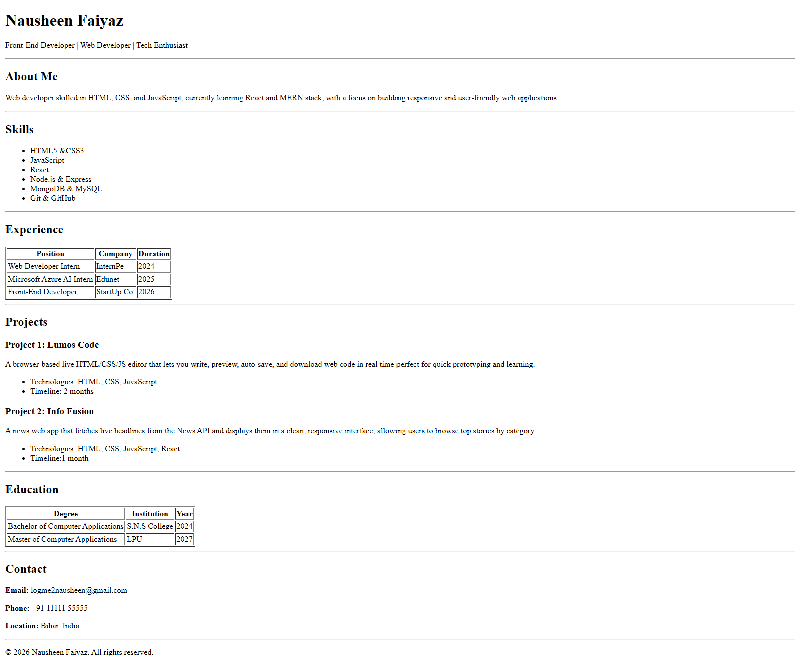

# HTML Resume Page
A single-page resume website built using pure HTML, designed as part of an assignment to demonstrate proper HTML structure, semantics, and layout consistency.

This project follows best practices for headings, sections, lists, tables, and semantic tags, closely matching the provided reference layout.

## 🌐 Live Demo

**View the live resume page here:**

[**Live Demo**](https://nausheenfaiyaz.github.io/HTML-Resume-Page/)

## 📌 Project Overview
**This resume page includes the following sections:**

- Header with name and professional roles
- About Me
- Skills list
- Experience table
- Projects section
- Education table
- Contact details
- Footer

The goal of this assignment is to focus on HTML semantics, readability, and clean structure without using any external libraries or frameworks.

## 🛠️ Tech Stack
- HTML5

No CSS or JavaScript used, as per assignment focus

## 🚀 Setup Steps

**1. Clone the repository:**

```bash
git clone https://github.com/NausheenFaiyaz/HTML-Resume-Page.git
```


**2. Navigate to the project folder:**

```bash
cd HTML-Resume-Page
```

**3. Open the index.html file in any web browser:**

- Double-click the file
OR

- Right-click → Open with browser

## 📄 Usage

- This project can be used as:

    - A basic HTML resume template

    - A learning reference for HTML semantics

    - A foundation to add CSS styling in future

- The code is well-structured and easy to modify for personal use.

## 🖼️ Screenshots



## 📚 Learning Outcomes

- Proper use of HTML semantic tags

- Clean document structure and hierarchy

- Correct usage of tables, lists, and sections

- Improved readability and accessibility

## 📌 Author

**Nausheen Faiyaz**

Web Developer | Front-End Developer | Tech Enthusiast