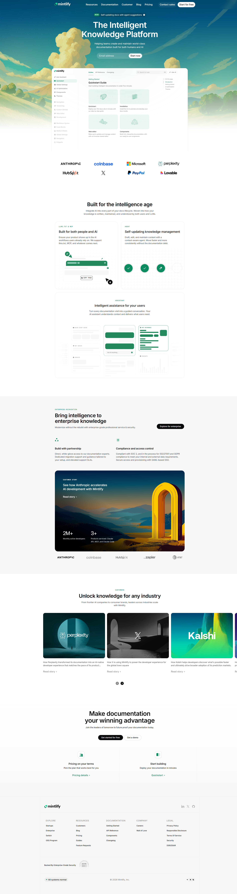

# Mintlify Landing Page Clone

This project is a **desktop-first recreation of the Mintlify documentation-style landing page**, built as part of a web development assignment.  
The focus was on **layout accuracy, content structure, and readability**, closely matching the original Mintlify front page.

🔗 **Live Site:**  
https://nausheenfaiyaz.github.io/Mintlify/

📂 **GitHub Repo:**  
https://github.com/NausheenFaiyaz/Mintlify

---

## Sections Recreated

- Top Navigation Bar  
- Hero Section  
- Documentation Preview (Sidebar + Content)  
- Trusted By / Logos  
- Feature Highlights  
- Intelligent Assistant UI Preview  
- Enterprise Features  
- Case Studies / Customer Stories  
- Final Call-To-Action  
- Footer  

---

## Tech Stack

- HTML5  
- CSS3  

---

## Fonts & Colors

- **Primary Font:** Inter  
- **Monospace Font:** Geist Mono  
- Fonts, colors, and overall visual styling closely match the original Mintlify website.

🔗 Brand Assets: https://brandfetch.com/mintlify.com

---

## Constraints Followed

- HTML & CSS only  
- No JavaScript, TailwindCSS, or animations  
- Desktop-only layout  
- Images and icons inspired by the original site  

---

## Project Demo

## Author

**Nausheen Faiyaz**  
Web Development Cohort Assignment
