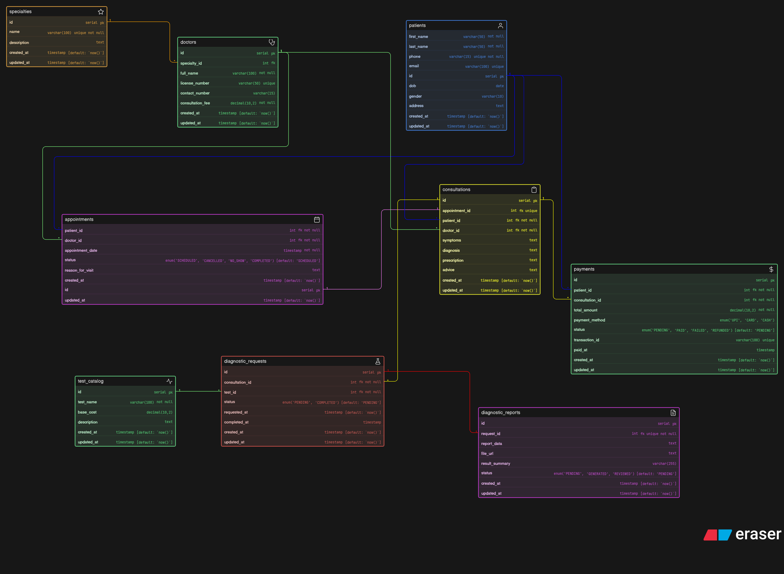

# 🧾 ER Diagram Schema (Conceptual)

This file contains the conceptual schema used to design the ER Diagram.

```sql

patients [icon: user, color: Blue] {
  id serial pk
  first_name varchar(50) not null
  last_name varchar(50) not null
  phone varchar(15) unique not null
  email varchar(100) unique
  dob date
  gender varchar(10)
  address text 
  created_at timestamp [default: `now()`]
  updated_at timestamp [default: `now()`]
}

specialties [icon: star, color: Orange] {
  id serial pk
  name varchar(100) unique not null
  description text
  created_at timestamp [default: `now()`]
  updated_at timestamp [default: `now()`]
}

doctors [icon: hospital, color: Green] {
  id serial pk
  specialty_id int fk
  full_name varchar(100) not null
  license_number varchar(50) unique
  contact_number varchar(15)
  consultation_fee decimal(10,2) not null
  created_at timestamp [default: `now()`]
  updated_at timestamp [default: `now()`]
}

appointments [icon: calendar, color: Purple] {
  id serial pk
  patient_id int fk not null
  doctor_id int fk not null
  appointment_date timestamp not null
  status enum('SCHEDULED', 'CANCELLED', 'NO_SHOW', 'COMPLETED') [default: 'SCHEDULED']
  reason_for_visit text
  created_at timestamp [default: `now()`]
  updated_at timestamp [default: `now()`]
}

consultations [icon: clipboard, color: Yellow] {
  id serial pk
  appointment_id int fk unique
  patient_id int fk not null
  doctor_id int fk not null
  symptoms text
  diagnosis text
  prescription text
  advice text
  created_at timestamp [default: `now()`]
  updated_at timestamp [default: `now()`]
}

test_catalog [icon: activity, color: Green] {
  id serial pk
  test_name varchar(100) not null
  base_cost decimal(10,2)
  description text
  created_at timestamp [default: `now()`]
  updated_at timestamp [default: `now()`]
}

diagnostic_requests [icon: flask, color: Red] {
  id serial pk
  consultation_id int fk not null
  test_id int fk not null
  status enum('PENDING', 'COMPLETED') [default: 'PENDING']
  requested_at timestamp [default: `now()`]
  completed_at timestamp
  created_at timestamp [default: `now()`]
  updated_at timestamp [default: `now()`]
}

diagnostic_reports [icon: file-text, color: Purple] {
  id serial pk
  request_id int fk unique not null
  report_data text
  file_url text
  result_summary varchar(255)
  status enum('PENDING', 'GENERATED', 'REVIEWED') [default: 'PENDING']
  created_at timestamp [default: `now()`]
  updated_at timestamp [default: `now()`]
}

payments [icon: dollar-sign, color: Green] {
  id serial pk
  patient_id int fk not null
  consultation_id int fk not null
  total_amount decimal(10,2) not null
  payment_method enum('UPI', 'CARD', 'CASH')
  status enum('PENDING', 'PAID', 'FAILED', 'REFUNDED') [default: 'PENDING']
  transaction_id varchar(100) unique
  paid_at timestamp
  created_at timestamp [default: `now()`]
  updated_at timestamp [default: `now()`]
}

specialties.id < doctors.specialty_id: [color: orange]

patients.id < appointments.patient_id: [color: blue]
doctors.id < appointments.doctor_id: [color: green]

appointments.id - consultations.appointment_id: [color: purple]
patients.id < consultations.patient_id: [color: blue]
doctors.id < consultations.doctor_id: [color: green]

consultations.id < diagnostic_requests.consultation_id: [color: yellow]
test_catalog.id < diagnostic_requests.test_id: [color: green]

diagnostic_requests.id - diagnostic_reports.request_id: [color: red]

patients.id < payments.patient_id: [color: blue]
consultations.id < payments.consultation_id: [color: yellow]

```

## 📎 ERD 

