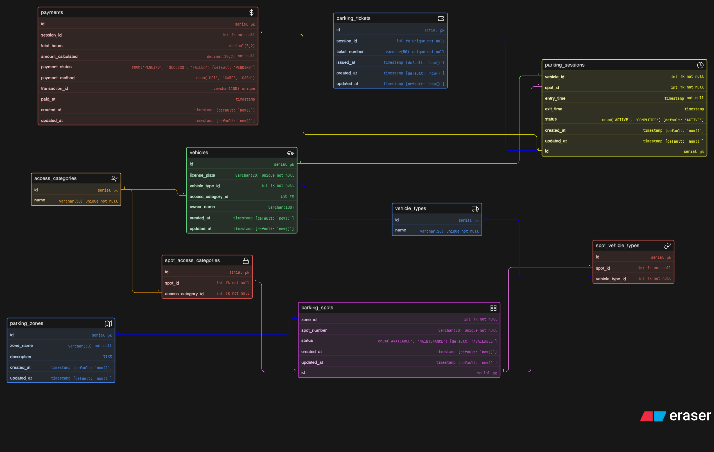

# 🧾 ER Diagram Schema (Conceptual)

This file contains the conceptual schema used to design the ER Diagram.

```sql

vehicle_types [icon: truck, color: Blue] {
  id serial pk
  name varchar(20) unique not null
}

access_categories [icon: user-check, color: Orange] {
  id serial pk
  name varchar(50) unique not null
}

vehicles [icon: car, color: Green] {
  id serial pk
  license_plate varchar(20) unique not null
  vehicle_type_id int fk not null
  access_category_id int fk
  owner_name varchar(100)
  created_at timestamp [default: `now()`]
  updated_at timestamp [default: `now()`]
}

parking_zones [icon: map, color: Blue] {
  id serial pk
  zone_name varchar(50) not null
  description text
  created_at timestamp [default: `now()`]
  updated_at timestamp [default: `now()`]
}

parking_spots [icon: grid, color: Purple] {
  id serial pk
  zone_id int fk not null
  spot_number varchar(20) unique not null
  status enum('AVAILABLE', 'MAINTENANCE') [default: 'AVAILABLE']
  created_at timestamp [default: `now()`]
  updated_at timestamp [default: `now()`]
}

spot_vehicle_types [icon: link, color: red] {
  id serial pk
  spot_id int fk not null
  vehicle_type_id int fk not null 
}

spot_access_categories [icon: lock, color: Red] {
  id serial pk
  spot_id int fk not null 
  access_category_id int fk not null
}

parking_sessions [icon: clock, color: Yellow] {
  id serial pk
  vehicle_id int fk not null
  spot_id int fk not null
  entry_time timestamp not null
  exit_time timestamp
  status enum('ACTIVE', 'COMPLETED') [default: 'ACTIVE']
  created_at timestamp [default: `now()`]
  updated_at timestamp [default: `now()`]
}

parking_tickets [icon: ticket, color: Blue] {
  id serial pk
  session_id int fk unique not null
  ticket_number varchar(50) unique not null
  issued_at timestamp [default: `now()`]
  created_at timestamp [default: `now()`]
  updated_at timestamp [default: `now()`]
}

payments [icon: dollar-sign, color: Red] {
  id serial pk
  session_id int fk not null
  total_hours decimal(5,2)
  amount_calculated decimal(10,2) not null
  payment_status enum('PENDING', 'SUCCESS', 'FAILED') [default: 'PENDING']
  payment_method enum('UPI', 'CARD', 'CASH')
  transaction_id varchar(100) unique
  paid_at timestamp
  created_at timestamp [default: `now()`]
  updated_at timestamp [default: `now()`]
}


vehicle_types.id < vehicles.vehicle_type_id: [color: blue]

access_categories.id < vehicles.access_category_id: [color: orange]

parking_zones.id < parking_spots.zone_id: [color: blue]

parking_spots.id < spot_vehicle_types.spot_id: [color: purple]
vehicle_types.id < spot_vehicle_types.vehicle_type_id: [color: blue]

parking_spots.id < spot_access_categories.spot_id: [color: purple]
access_categories.id < spot_access_categories.access_category_id: [color: orange]

vehicles.id < parking_sessions.vehicle_id: [color: green]
parking_spots.id < parking_sessions.spot_id: [color: purple]

parking_sessions.id - parking_tickets.session_id: [color: blue]

parking_sessions.id < payments.session_id: [color: yellow]

```

## 📎 ERD 

