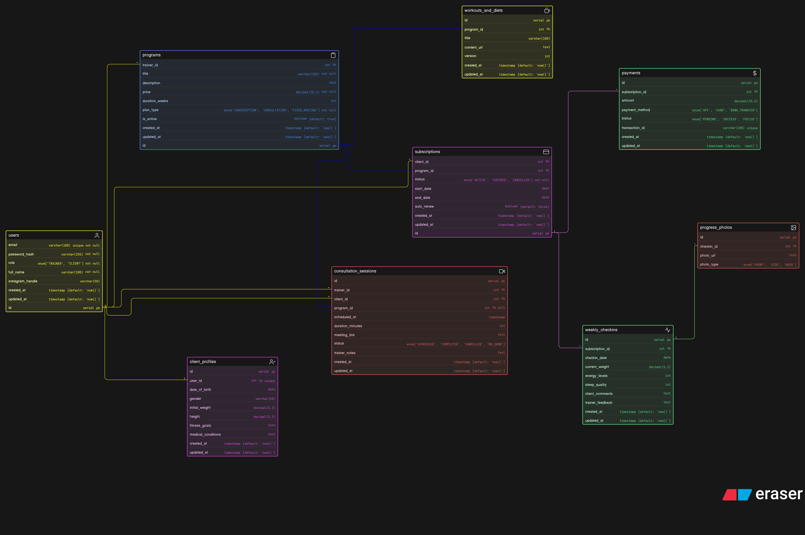

# 🧾 ER Diagram Schema (Conceptual)

This file contains the conceptual schema used to design the ER Diagram.

```sql

users [icon: user, color: Yellow]{
  id serial pk
  email varchar(100) unique not null
  password_hash varchar(255) not null
  role enum['TRAINER', 'CLIENT'] not null
  full_name varchar(100) not null
  instagram_handle varchar(50)
  created_at timestamp [default: `now()`]
  updated_at timestamp [default: `now()`]
}

client_profiles [icon: user-check, color: Purple]{
  id serial pk
  user_id int fk unique
  date_of_birth date
  gender varchar(20)
  initial_weight decimal(5,2)
  height decimal(5,2)
  fitness_goals text
  medical_conditions text
  created_at timestamp [default: `now()`]
  updated_at timestamp [default: `now()`]
}

programs [icon: clipboard, color: Blue]{
  id serial pk
  trainer_id int fk
  title varchar(255) not null
  description text
  price decimal(10,2) not null
  duration_weeks int
  plan_type enum['SUBSCRIPTION', 'CONSULTATION', 'FIXED_ROUTINE'] not null
  is_active boolean [default: true]
  created_at timestamp [default: `now()`]
  updated_at timestamp [default: `now()`]
}

subscriptions [icon: credit-card, color: Purple]{
  id serial pk
  client_id int fk
  program_id int fk
  status enum['ACTIVE', 'EXPIRED', 'CANCELLED'] not null
  start_date date
  end_date date
  auto_renew boolean [default: false]
  created_at timestamp [default: `now()`]
  updated_at timestamp [default: `now()`]
}

consultation_sessions [icon: video, color: Red]{
  id serial pk
  trainer_id int fk
  client_id int fk
  program_id int fk null
  scheduled_at timestamp
  duration_minutes int
  meeting_link text
  status enum['SCHEDULED', 'COMPLETED', 'CANCELLED', 'NO_SHOW']
  trainer_notes text
  created_at timestamp [default: `now()`]
  updated_at timestamp [default: `now()`]
}

weekly_checkins [icon: activity, color: Green]{
  id serial pk
  subscription_id int fk
  checkin_date date
  current_weight decimal(5,2)
  energy_levels int // scale 1-10
  sleep_quality int // scale 1-10
  client_comments text
  trainer_feedback text
  created_at timestamp [default: `now()`]
  updated_at timestamp [default: `now()`]
}

progress_photos [icon: image, color: Red]{
  id serial pk
  checkin_id int fk
  photo_url text
  photo_type enum['FRONT', 'SIDE', 'BACK']
}

workouts_and_diets [icon: coffee, color: Yellow]{
  id serial pk
  program_id int fk
  title varchar(100)
  content_url text
  version int
  created_at timestamp [default: `now()`]
  updated_at timestamp [default: `now()`]
}

payments [icon: dollar-sign, color: Green]{
  id serial pk
  subscription_id int fk
  amount decimal(10,2)
  payment_method enum['UPI', 'CARD', 'BANK_TRANSFER']
  status enum['PENDING', 'SUCCESS', 'FAILED']
  transaction_id varchar(100) unique
  created_at timestamp [default: `now()`]
  updated_at timestamp [default: `now()`]
}

users.id - client_profiles.user_id: [color: yellow]
users.id < programs.trainer_id: [color: yellow]
users.id < subscriptions.client_id: [color: yellow]
users.id < consultation_sessions.trainer_id: [color: yellow]
users.id < consultation_sessions.client_id: [color: yellow]

programs.id < subscriptions.program_id: [color: blue]
programs.id < workouts_and_diets.program_id: [color: blue]
programs.id < consultation_sessions.program_id: [color: blue]

weekly_checkins.id < progress_photos.checkin_id: [color: green]

subscriptions.id < weekly_checkins.subscription_id: [color: purple]
subscriptions.id < payments.subscription_id: [color: purple]

```

## 📎 ERD 

