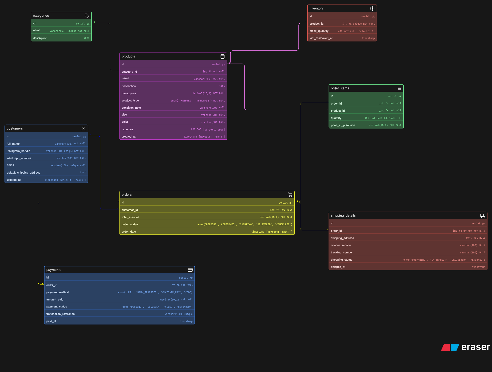

# 🛍️ Instagram Thrift & Handmade Store – ER Diagram

## 📌 Overview

This project presents a **database design (ER Diagram)** for a small Instagram-based thrift and handmade store.

Initially, the business operates through Instagram DMs and WhatsApp, but as it grows, a structured system is needed to manage:

* Products
* Inventory
* Orders
* Customers
* Payments
* Shipping

This ERD models a **real-world scalable backend structure** for such a business.

---

## 🧠 Design Goals

* Handle both **thrifted (unique)** and **handmade (multiple stock)** products
* Track **orders and order history**
* Manage **inventory efficiently**
* Support **payment tracking and retries**
* Store **shipping and delivery details**
* Keep the database **normalized and clean**

---

## 🧩 Entities & Explanation

### 👤 Customers

Stores customer information collected via Instagram/WhatsApp.

**Why?**

* One customer can place multiple orders
* Email is optional because many users interact only via WhatsApp/Instagram

---

### 🏷️ Categories

Stores product categories like clothing, jewelry, decor.

**Why?**

* Avoids repetition in product table
* Keeps database normalized

---

### 🛍️ Products

Stores all product details.

**Key Features:**

* `product_type` distinguishes **THRIFTED vs HANDMADE**
* `condition_note` applies only to thrift items
* Supports size, color, etc.

**Why single table?**

* Both product types share similar attributes
* Avoids duplication (better normalization)

---

### 📦 Inventory

Tracks stock for each product.

**Why separate table?**

* Clean separation of stock logic
* Handles:

  * Thrift → stock = 1
  * Handmade → stock > 1

---

### 🛒 Orders

Represents a purchase made by a customer.

**Why?**

* Stores order lifecycle (pending → delivered)
* Links customer to purchases

---

### 📋 Order_Items (Junction Table)

Connects orders and products.

**Why needed?**

* One order can contain multiple products
* One product can appear in multiple orders

**Extra:**

* `price_at_purchase` stores historical price

---

### 💳 Payments

Tracks payment attempts and status.

**Why separate table?**

* Allows multiple payment attempts (failed → retry)
* Stores payment method and transaction reference

---

### 🚚 Shipping Details

Tracks delivery information.

**Why separate table?**

* Keeps order table clean
* Stores tracking info and delivery status

---

## 🔗 Relationships

* One **Customer → Many Orders**
* One **Order → Many Order Items**
* One **Product → Many Order Items**
* One **Product → One Inventory**
* One **Order → Many Payments**
* One **Order → One Shipping Record**
* One **Category → Many Products**

---

## ⚙️ Key Design Decisions

### ✔ Single Product Table

Used a single `products` table with a `product_type` field instead of separate tables to avoid redundancy.

---

### ✔ Inventory Separation

Stock is handled in a separate table to support both unique and bulk products cleanly.

---

### ✔ ENUM Usage

Used ENUMs for:

* order_status
* payment_status
* product_type
* shipping_status

This ensures **data consistency**.

---

### ✔ Normalization

* Removed redundant data
* Used foreign keys for relationships
* Created separate tables where necessary

---

### ✔ Real-World Considerations

* Payment retries supported
* Historical price tracking
* Optional email handling
* Flexible shipping addresses

---

## 🏁 Conclusion

This ER diagram represents a **clean, scalable, and real-world database design** for a growing Instagram-based store.

It balances:

* Simplicity (for a small business)
* Scalability (for future growth)
* Data integrity (through proper relationships and constraints)

---

## 📎 Diagram

---

