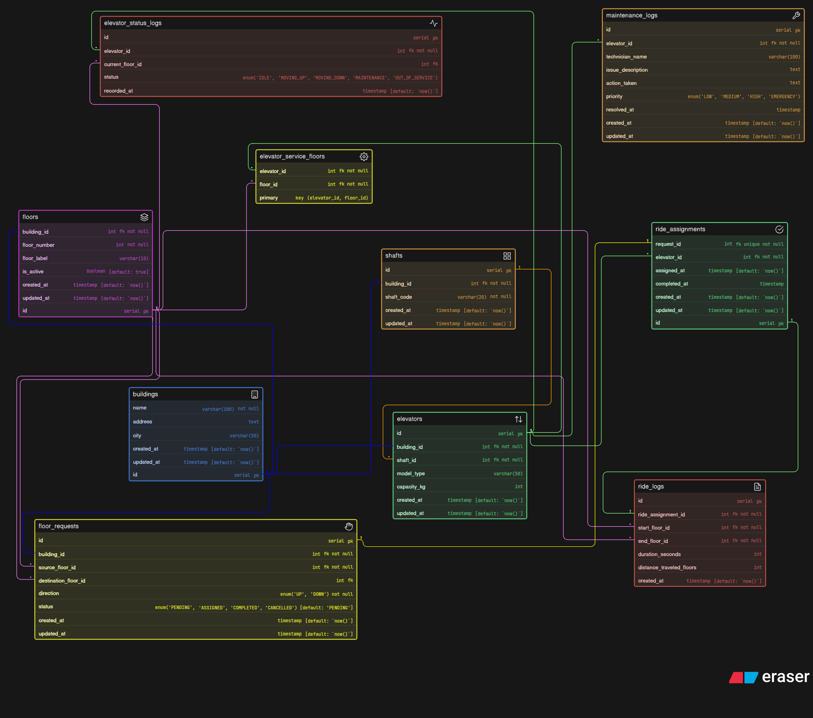

# 🚀 Smart Elevator Control System - ERD

## 📌 About this ERD

So for this assignment, I designed a Smart Elevator Control System which works for large buildings like malls, offices, etc. where multiple elevators operate together.

The goal was to not just create tables, but actually think how a real system would work behind the scenes handling requests, assigning elevators, tracking rides and maintenance.

## 🧠 What I focused on

Instead of mixing everything in one place, I tried to separate things properly:

- building structure
- elevator configuration
- real-time activity (requests & rides)
- maintenance & status

Basically, I didn’t want to treat this like a simple DB more like a system design problem.

## 🏗️ Tables & what they store

### 🔹 buildings

Stores basic building info like name, address, city.

### 🔹 floors

Each floor belongs to a building.

Used for tracking where requests come from and where elevators move.

### 🔹 shafts

Each building has multiple shafts and each shaft contains one elevator.

This helps keep the structure realistic.

### 🔹 elevators

Stores elevator details like capacity, model, and which shaft it belongs to.

I did not store live status here to avoid mixing dynamic data.

### 🔹 elevator_service_floors

This is a junction table.

- One elevator can serve multiple floors
- One floor can be served by multiple elevators

So this handles that many-to-many relationship.

### 🔹 elevator_status_logs

Instead of storing current status in elevator table, I created this.

**Tracks:**

- current floor
- movement status (idle, moving, maintenance)

This allows tracking history instead of overwriting data.

### 🔹 floor_requests

Whenever a user presses a button, a request is created here.

**Includes:**

- source floor
- destination floor (optional)
- direction (up/down)
- status

### 🔹 ride_assignments

Each request is assigned to one elevator.

**This table connects:**

- request → elevator

### 🔹 ride_logs

Stores actual ride execution data.

**Like:**

- start floor
- end floor
- duration
- distance

Used for analytics later.

### 🔹 maintenance_logs

**Tracks all maintenance activity:**

- issue
- technician
- action taken
- priority

This is kept separate so elevator data stays clean.

## 🔗 Relationships (how everything connects)
- One building → many floors
- One building → many elevators
- One shaft → one elevator
- Elevators ↔ floors → many-to-many
- One request → one assignment
- One assignment → one ride log
- One elevator → many maintenance logs

## ⚙️ Design decisions

- ❌ Did NOT store dynamic data inside elevator
- ✅ Created separate tables for status & logs
- ✅ Used junction table for floor servicing
- ✅ Kept request → assignment → ride flow clear
- ✅ Avoided overcomplicating while keeping it realistic

## 🎯 What this system can answer
- Which elevator handled which request
- Which floors are served by which elevators
- Current and past elevator status
- Ride history and usage
- Pending vs completed requests
- Maintenance tracking

## 🚀 Final thought

This ERD is designed to feel like something that could actually run in a real building system, not just an assignment.

Tried to keep it clean, scalable, and practical.

## 📎 Diagram

---
## 🧾 Full Schema

For the complete schema definition:

**[View Full Schema](./schema.md)**